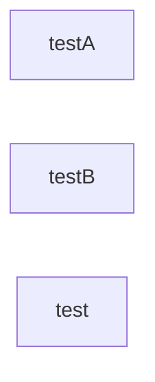

```mermaid
graph TD;

B["Bücher"] & S["Skripte"] & V["Vorlesungen"] & P["Papers"] & -->T{{"Triage"}};
 -->T;
P["Papers"] -->T;
A["Blog-Artikel"] -->T;


```

```mermaid
graph LR;
A[testA]
B[testB]
C[test]
```