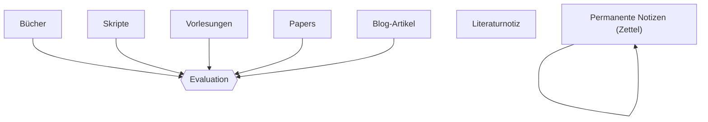

```mermaid
graph TD;

B["Bücher"]
S["Skripte"]
V["Vorlesungen"]
P["Papers"]
A["Blog-Artikel"]

E{{"Evaluation"}}

L["Literaturnotiz"]
Z["Permanente Notizen (Zettel)"]

B & S & V & P & A --> E

Z -->Z

```
