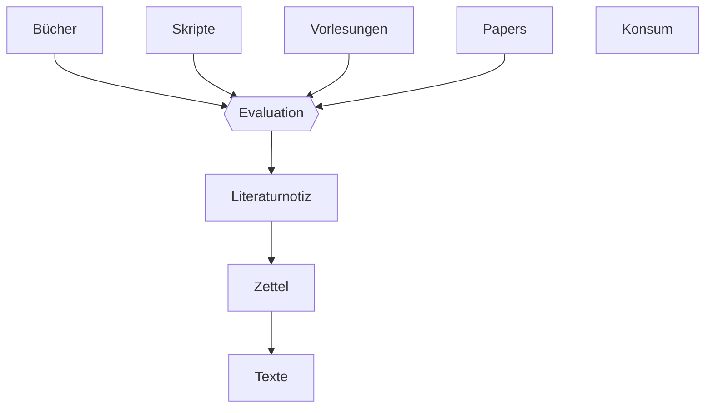

```mermaid
graph TD;

B["Bücher"]
S["Skripte"]
V["Vorlesungen"]
P["Papers"]

E{{"Evaluation"}}
K["Konsum"]


L["Literaturnotiz"]
Z["Zettel"]
T["Texte"]
B & S & V & P --> E

E --> L
L --> Z
Z --> T

```
