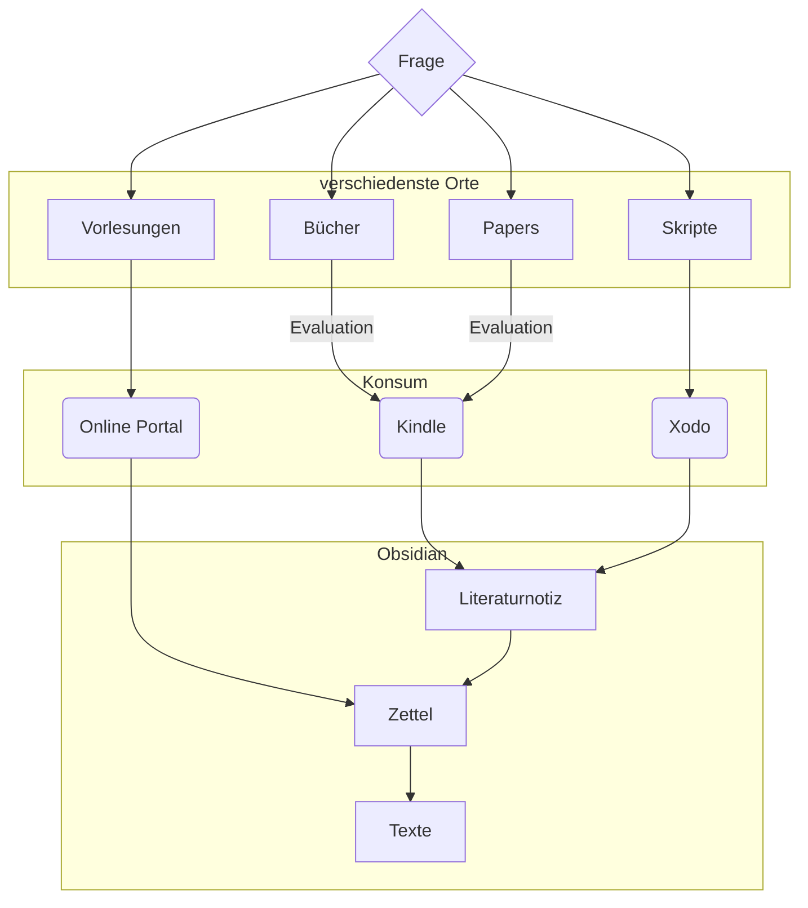

```mermaid
flowchart TB;

F{Frage}

B[Bücher]
S[Skripte]
V[Vorlesungen]
P[Papers]

K(Kindle)
X(Xodo)
OP(Online Portal)

L[Literaturnotiz]
Z[Zettel]
T[Texte]

F --> B & P & S & V

subgraph verschiedenste Orte
	B
	P
	S
	V
end

B & P -->|Evaluation| K
S --> X
V --> OP

subgraph Konsum
	K
	X
	OP
end

K --> L
X --> L
OP --> Z

subgraph Obsidian	
	L --> Z
	Z --> T
end

```