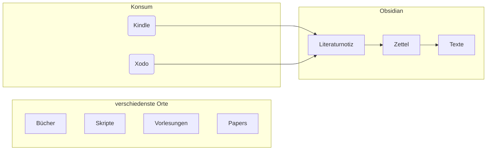

```mermaid
graph LR;

B["Bücher"]
S["Skripte"]
V["Vorlesungen"]
P["Papers"]

K("Kindle")
X("Xodo")

L["Literaturnotiz"]
Z["Zettel"]
T["Texte"]

subgraph verschiedenste Orte
	B
	S
	V
	P
end

subgraph Konsum
	K
	X
end

K --> L
X --> L

subgraph Obsidian	
	L --> Z
	Z --> T
end
```