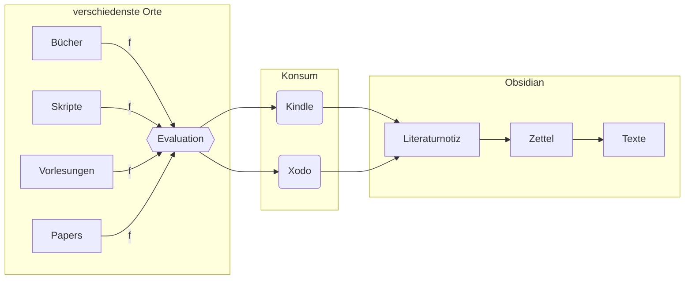

```mermaid
graph LR;

B["Bücher"]
S["Skripte"]
V["Vorlesungen"]
P["Papers"]

E{{"Evaluation"}}
K("Kindle")
X("Xodo")

L["Literaturnotiz"]
Z["Zettel"]
T["Texte"]

subgraph verschiedenste Orte
	B & S & V & P -->|f| E
end

subgraph Konsum
	E --> K
	E--> X
end

subgraph Obsidian
	K --> L
	X --> L
	
	L --> Z
	Z --> T
end
```