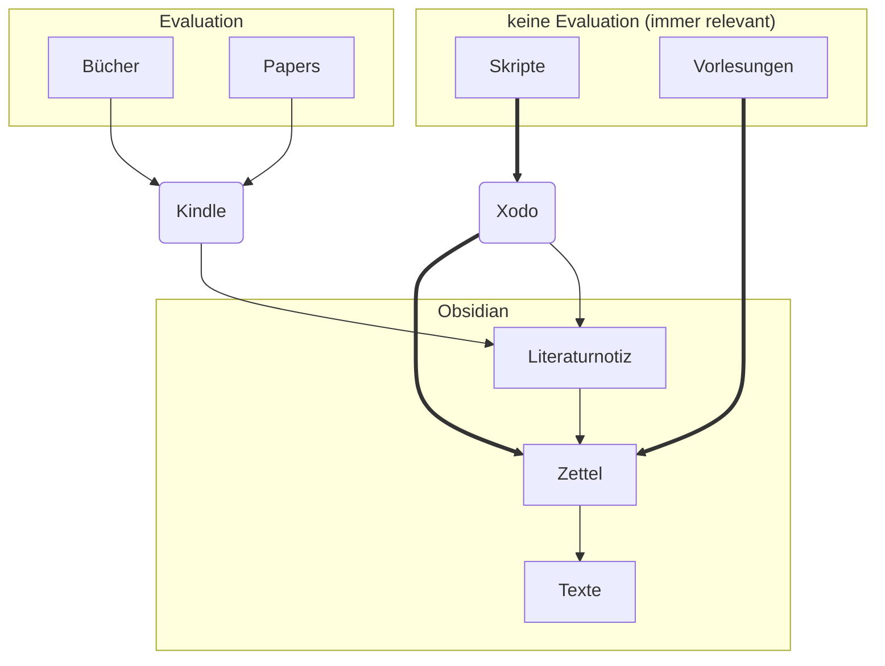

[[§Second Brain]] [[2021-01-14]]

---

```mermaid
graph TB;

B[Bücher]
S[Skripte]
V[Vorlesungen]
P[Papers]

K(Kindle)
X(Xodo)

L[Literaturnotiz]
Z[Zettel]
T[Texte]

subgraph Evaluation
	B
	P
end

subgraph "keine Evaluation (immer relevant)"
	S
	V
end

B & P --> K 
S ==> X

K
X

K --> L
X --> L
X ==> Z
V ==> Z

subgraph Obsidian	
	L --> Z
	Z --> T
end
```