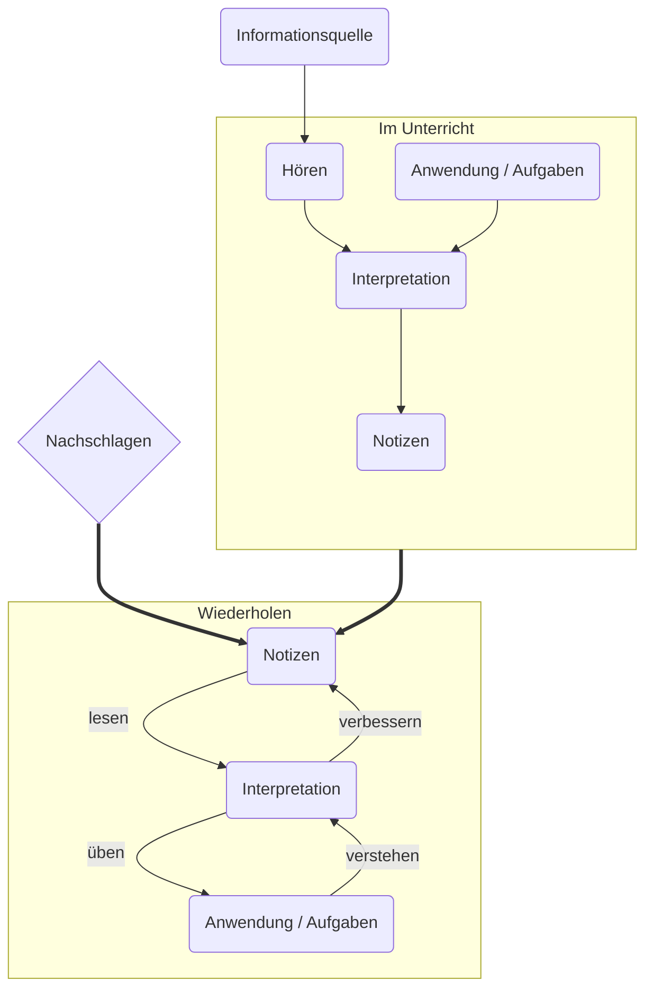

## Einfachheit / Schwierigkeit der verschiedenen Stufen bei verschiedenen Mitteln

|                                        |       Digital       |        Digital         |        Digital        |    Analog     |
| --------------------------------------:|:-------------------:|:----------------------:|:---------------------:|:-------------:|
|                                Eingabe |      Tastatur       | Tastatur + Handschrift |      Handschrift      |  Handschrift  |
|                              Beispiele |       Remnote       |        OneNote         | Goodnotes, Notability | Hefte, Ordner |
|                             ---------- |     ----------      |       ----------       |      ----------       |     ----------     |
|                             Lesbarkeit |       ⭐⭐⭐        |      ⭐⭐                  |         ⭐⭐          |      ⭐       |
| Wie einfach ist es richtig zu arbeiten |       ⭐⭐⭐        |        ⭐⭐                |        ⭐⭐⭐         |      ⭐       |
|         Einbinden verschiedener Medien |       ⭐⭐⭐        |         ⭐⭐⭐               |         ⭐⭐          |      ⭐       |
|             Wissen rekontextualisieren |       ⭐⭐⭐        |        ⭐⭐                |         ⭐⭐          |     ⭐⭐      |
|                              Ablenkung |        ⭐         |          ⭐              |          ⭐           |    ⭐⭐⭐     |
|                           Wiederholung |       ⭐⭐⭐        |     ⭐                   |          ⭐           |      ⭐       |
|                   Wiederholung (+Anki) | ⭐⭐⭐(nicht nötig) |       ⭐⭐                 |         ⭐⭐          |     ⭐⭐      |
|                   Arbeitserleichterung |       ⭐⭐⭐        |          ⭐⭐              |         ⭐⭐          |      ⭐       |
