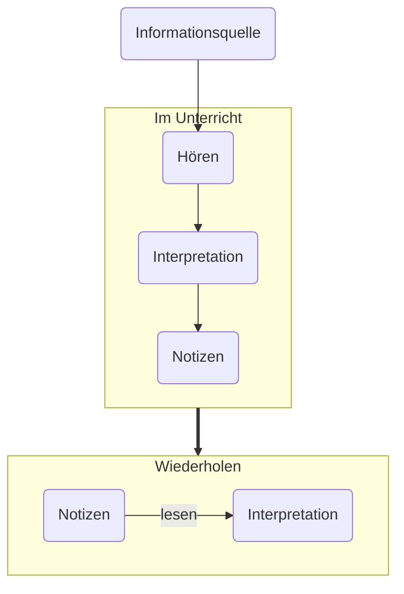

```mermaid
flowchart TB

Iq(Informationsquelle)
N(Notizen)
H(Hören)
I(Interpretation)
I2(Interpretation)
N2(Notizen)
Iq --> H

subgraph Ps[Im Unterricht]
	H --> I
	I --> N
end

subgraph Pt[Wiederholen]
	N2 -->|lesen| I2
end

Ps ==> Pt
```